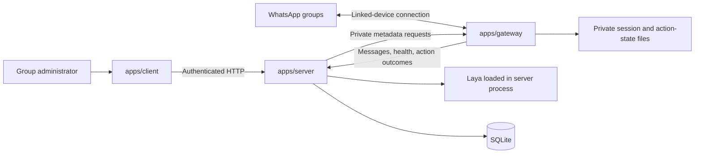

# Fidel v0 — High-Level Design

Status: proposed implementation design, not a description of completed features.

## 1. Goal

Let a group administrator add Fidel to an existing WhatsApp group, select
moderation policies, inspect decisions, and opt into automatic removal of
violating text messages. Ship a small pilot quickly, then improve it from actual
usage. Build in dependent blocks and stop for manual acceptance after each one.

The current repository structure takes precedence over earlier naming ideas:

- `apps/server`: FastAPI, Python, uv; application backend and Laya inference.
- `apps/gateway`: Node.js, Express, TypeScript, Baileys; WhatsApp integration.
- `apps/client`: TanStack Start, React, Tailwind; administrator dashboard.

Marketing is excluded from v0.

## 2. Scope and deliberate limits

Include one operator-owned bot number, multiple independently configured groups,
website login, verified group ownership, policy presets, observe/enforce modes,
pause, connection status, and recent moderation history.

Support new text messages only. Ignore history sync, the bot's own messages,
protocol events, media, and message edits in v0. Handle the onboarding command
separately from moderation. Unsupported content is left untouched.

Defer customer-owned bot accounts, organizations and team roles, billing,
unrestricted natural-language policy builders, media analysis, automated bans,
appeals workflows, other messaging platforms, and advanced analytics.

Use one server deployment, SQLite, and direct HTTP communication. No Redis,
message broker, distributed workers, vector database, or separate model service.

## 3. Architecture and ownership

**Server:** owns user sessions, permissions, group ownership, policy versions,
moderation decisions, application persistence, and history. Only the server
accesses SQLite. Keep HTTP handlers thin, with focused auth, groups, moderation,
and gateway-client modules. No generic plugin framework.

**Gateway:** owns pairing, Baileys session persistence, reconnects, message
normalization, group metadata lookup, deletion execution, and outcome reporting.
It never evaluates policies or runs Laya. Express serves health and private
metadata endpoints. Its own credential/action files are operational state, not
access to the application database.

**Client:** owns login screens, onboarding, group controls, and history display.
It calls FastAPI. It does not access Baileys or SQLite, and does not duplicate
backend authorization or moderation logic. TanStack server functions are used
only when necessary for request/session transport.

## 4. Main user flow

1. The operator pairs Fidel's dedicated account privately on the server.
2. A user signs into the dashboard.
3. The dashboard shows the bot number and creates an expiring, single-use claim
   code tied to that user.
4. The user adds the bot to their group, makes it an admin, and posts
   `!fidel connect <code>` in the group.
5. The gateway forwards this command even though the group is not enabled yet.
   Other messages from unconfigured groups are ignored.
6. The server requests current group metadata from the gateway and verifies
   that both the command sender and bot are admins. It consumes the code and
   links the group to the signed-in user and verified WhatsApp identity.
7. The user selects policies. The group starts in observe mode.
8. After checking sample decisions, the user enables enforcement or pauses it.

Use one dashboard owner per group in v0. Reject claims for an already-owned
group; ownership recovery is an operator task, not a transfer workflow.
Website users never pair their personal WhatsApp accounts with Fidel.

## 5. Authentication and authorization

Use one OAuth login provider for v0 (Google), through an established Python OAuth
library. FastAPI owns the callback, user record, and opaque server-side session.
Use the provider's stable subject identifier as the external identity. There is
no password registration, password reset, or separate client auth system.

Use HttpOnly session cookies, Secure in production, SameSite protection, OAuth
state validation, and CSRF protection for authenticated mutations. Sessions
expire and logout invalidates them. Serve the client and `/api` under one public
origin in deployment; use a development proxy for the equivalent local flow.

Every group endpoint checks the session and group ownership. Verify the linked
WhatsApp identity's continued admin status using fresh metadata or a short-lived
cache (at most 60 seconds). Fail closed for protected access when that status
cannot be established. Invalidate cached metadata on membership/admin changes.
Stop enforcement when the bot loses admin permission or ownership becomes
invalid, and show that state to the owner.

Use a separate environment-provided service token on every private gateway/server
request. Bind private gateway endpoints to the internal network. Never expose
the token, pairing data, or linked-device keys to dashboard users.

## 6. Message and decision flow

1. The gateway receives a new text message and preserves its original Baileys
   message key, including the participant identifier required for deletion.
2. It filters bot messages, history, unsupported events, and disabled groups.
   It obtains the enabled group list from the server and refreshes it periodically.
3. It submits a normalized event to the server. The server remains authoritative
   about whether the group is enabled or paused, regardless of gateway cache.
4. The server uses `(bot_account_id, group_id, message_id)` as a unique event key.
   An existing event reuses its record and decision. An event still processing
   returns a processing/no-action response rather than starting another inference.
5. The server snapshots the active policy version and applies deterministic rules
   followed by Laya where relevant.
6. It stores the assessment and derives `allow`, `review`, or `delete`.
7. Observe mode records the proposed decision but emits no deletion action.
   Enforce mode emits a deletion only for a validated rule or model threshold.
8. The gateway checks the action expiry and records the action ID before calling
   Baileys. It reports success, failure, or unknown outcome to the server.

Decisions and execution are separate fields: an observed `delete` decision does
not mean a message was removed. An accepted Baileys call does not prove removal
from every recipient's device. The UI should say “deletion requested” where
that is the strongest evidence available.

Policy changes apply to newly accepted events. Already-issued actions may finish;
the dashboard should not promise that pause cancels a request already in flight.
Use a short action expiry (30 seconds initially) to prevent stale execution.

## 7. Moderation behavior

Start with blocked domains as the exact-rule implementation. Add a small preset
catalogue for personal abuse and unwanted promotions with explicit definitions,
examples, and exceptions. Keep automatic model enforcement disabled until the
relevant preset and target languages pass manual evaluation.

The application, not the model, chooses the action. Store the preset/rule ID and
score rather than inventing a natural-language explanation. Treat message text
as data, including text that tries to change instructions.

Initialize Laya during FastAPI lifespan startup and reuse it. Run a single server
process initially to avoid multiple copies of model weights. Execute inference
off the HTTP event loop with bounded concurrency; start with one inference at a
time. If busy or unavailable, record review/unavailable and leave content intact.
Do not accumulate an unlimited in-memory backlog. A timed-out inference may
finish internally but must not generate a late deletion action.

Start with short text and bounded policy prompts. Inputs exceeding the supported
budget go to review rather than silently truncating away relevant content.
Evaluate mixed languages and transliteration explicitly. A high model score is
not sufficient evidence of accuracy without evaluation on the intended policy.

Model download/cache preparation happens during deployment setup. CPU is the
initial option; add GPU hosting only if measured latency and volume require it.

## 8. Minimal persistence

Use SQLite on a persistent local volume with migrations. Keep these concepts in
the server; exact tables can be combined where that simplifies implementation:

- Users and sessions: external login identity, session expiry and revocation.
- Group claims: hashed code, user, expiry, consumed state.
- Groups: WhatsApp group ID, owner, verified WhatsApp identity, mode, enabled state.
- Policy versions: selected presets, options, version and update timestamp.
- Moderation events: unique message key, policy version, assessment, decision,
  timestamps, processing/error state, and optional short message excerpt.
- Actions: unique action ID, event reference, expiry, execution status and error.

Store only recent history: a proposed v0 default is 7 days for message excerpts
and 30 days for decision metadata. Never store full group history. Purge expired
records with a small daily task in the existing server process and on startup.
Do not include message content in ordinary application logs.

The gateway persists Baileys session updates and a small bounded action journal
on its own volume. Credentials stay outside Git, with restrictive permissions
and encrypted persistent storage for deployment. No separate secrets platform
is required for v0.

## 9. HTTP contracts

Use ordinary JSON HTTP, validated by FastAPI schemas and matching TypeScript
types. Do not introduce a shared package or code-generation pipeline yet.

Public server routes cover login/callback/logout, current user, claim creation,
owned groups, group settings, recent moderation history, and connection health.
Paginate history. Settings updates increment the policy version atomically.

Private contracts:

- Gateway → server: submit message/claim command; retrieve enabled group IDs;
  report heartbeat and action outcome.
- Server → gateway: retrieve current metadata for a specific group.
- Message response: event ID, decision, policy version, and optional action with
  action ID, target message key, action type, and expiry.

The gateway polls enabled groups and sends heartbeats every 10 seconds initially.
The client polls visible health/history every 10 seconds. Mark heartbeat state
stale after 30 seconds; never show an old heartbeat as proof of connectivity.
No browser WebSocket or server-sent event infrastructure in v0.

## 10. Failure handling without a queue

Direct HTTP is sufficient for the pilot. Database uniqueness and stable action
IDs provide duplicate protection; a queue would not supply that automatically.

- Server unavailable: use a small bounded number of submission retries, then
  drop the live event and report the gap. Do not delete locally or promise replay.
- Model unavailable, busy, uncertain, or too slow: leave the message untouched.
- Gateway disconnected: reconnect with bounded backoff; show degraded health.
  Do not moderate synchronized historical messages after reconnect.
- Missing permissions or invalid target: report failure without endless retries.
- Duplicate successful action: report the known outcome without executing again.
- Crash during deletion: mark the persisted in-flight action unknown on restart;
  do not blindly replay it. Exactly-once execution is not promised.
- Outcome reporting failure: retry the report using the same action ID; do not
  repeat the deletion just because its report failed.

Keep request timeouts finite and retry budgets small. Accept that messages during
outages can escape moderation in v0. Add durable buffering only when pilot usage
demonstrates a need.

## 11. Dashboard

Build only login, group onboarding, group list, group detail/settings, and recent
history. Each group detail shows bot connection/admin status, current mode,
selected policies, and recent assessment/action outcomes.

Provide clear empty, loading, unauthorized, disconnected, and failure states.
Confirm settings saves with the server before showing them as applied. Include a
plain-language notice that the bot processes text and deletion follows delivery;
users may already have seen the message. No restore-message promise.

## 12. Deployment and local development

Use the existing pnpm workspace and uv setup. Local ports remain client 3000,
gateway 3001, and server 8000. Use root commands: `pnpm dev` or the app-specific
`pnpm dev:client`, `pnpm dev:gateway`, and `pnpm dev:server`.

For the pilot, run the three apps with Docker Compose on one always-on host,
behind a simple HTTPS reverse proxy. Persist SQLite, the model cache, and gateway
state on separate volumes. Keep gateway traffic internal. Configure restart
policies, health endpoints, and simple backups; no Kubernetes or autoscaling.

One shared bot is a shared failure point for all groups. Baileys is an unofficial
integration and may disconnect, break with protocol changes, or face account
restrictions. Official WhatsApp group message deletion was unsupported in the
documentation reviewed during planning. Confirm live behavior in the first
blocks rather than treating the design as proof of platform support.

## 13. Incremental delivery and manual acceptance

No TDD or automated test suite unless requested. For every block, implement only
its scope, run applicable existing checks, document three focused manual checks,
and stop for the user's acceptance. Address feedback before advancing. Leave all
changes uncommitted.

### Block 1 — Gateway connection

Pair the dedicated bot, receive new text from one configured test group, and
persist/recover the connection. No server integration or deletion.

Manual checks: pair; receive a phone-sent text; restart and reconnect without
re-pairing. Historical and bot messages must not appear as new moderation events.

### Block 2 — Server integration and exact-rule moderation

Forward events to FastAPI, persist records in SQLite, and implement a seeded
blocked-domain policy with observe/enforce/pause. Add duplicate protection and
action reporting alongside the first deletion operation.

Manual checks: allowed versus blocked text; observe/pause behavior; duplicate
delivery and missing admin permission produce accurate records without repeats.

### Block 3 — Laya assessment

Load Laya once and add the small preset catalogue in observe mode. Validate
examples before selectively enabling model-based deletion.

Manual checks: clear allowed/violating samples; ambiguous and mixed-language
samples; unavailable inference leaves messages intact.

### Block 4 — Login and group onboarding

Add OAuth sessions, the minimal dashboard, claim codes, and verified group
ownership. Replace seeded-only access with server-enforced user permissions.

Manual checks: admin claims a group; non-admin claim fails; another website user
cannot access or modify the claimed group.

### Block 5 — Dashboard operation

Add policy configuration, mode/pause controls, health, and recent history.

Manual checks: updated policy affects new messages; pause/resume works; history
distinguishes observe decisions, deletion requests, failures, and unknown results.

### Block 6 — Deploy and invite pilot users

Finish deployment, retention, recovery visibility, and onboarding instructions.
Basic permissions and duplicate protection must already exist from prior blocks.

Manual checks: deployed restart recovery; disconnection is visible; two groups
with different owners and policies remain isolated.

Run `pnpm check:gateway`, `pnpm check:server`, or `pnpm check:client` for isolated
app changes. Run `pnpm check` and `pnpm build` for cross-app implementation changes.
Never claim actual WhatsApp delivery/deletion was verified without observing it.

## 14. v0 completion

An external administrator can sign in, connect their group, select a policy,
observe its decisions, enable validated enforcement, pause it, and inspect real
outcomes. The operator can restart the deployment without losing configuration
or requiring routine re-pairing. Known outage and unofficial-integration limits
are visible. Marketing and deferred features do not block this milestone.

## References

- [Laya repository and limitations](https://github.com/NandhaKishorM/laya)
- [Baileys repository](https://github.com/WhiskeySockets/Baileys)
- [WhatsApp Groups API](https://developers.facebook.com/documentation/business-messaging/whatsapp/groups)
- [WhatsApp message deletion behavior](https://faq.whatsapp.com/1370476507114859/)

Library capabilities and model accuracy must be checked during implementation;
the design does not assume the repository's benchmark claims prove our use case.
